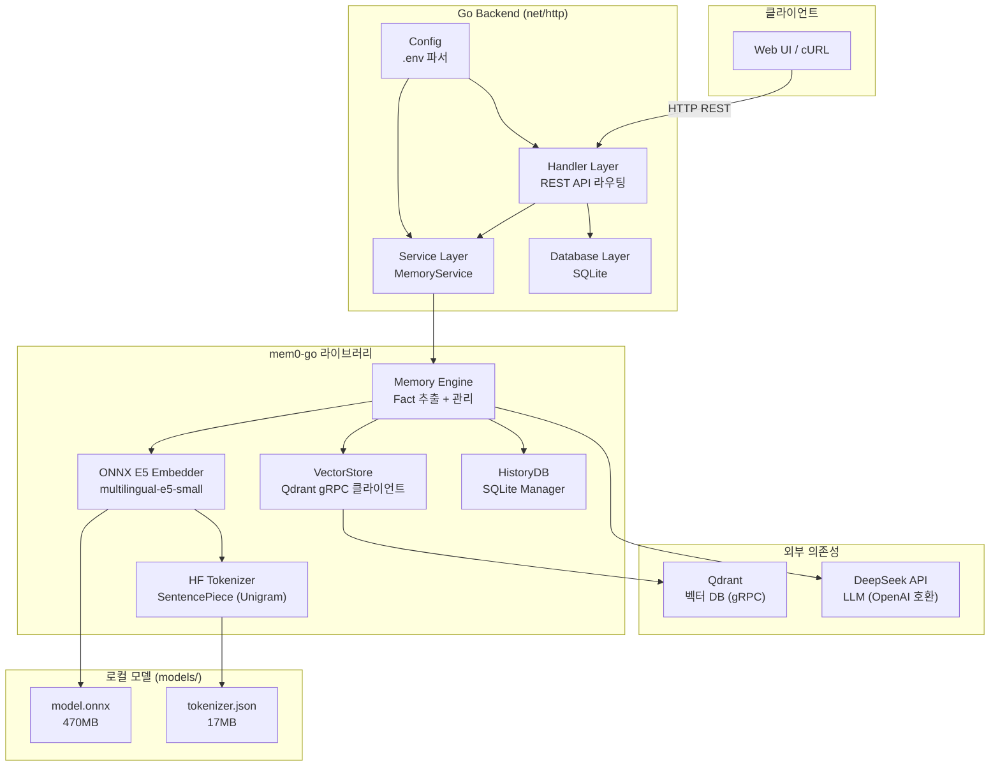

# 시스템 아키텍처

> lges-mem0ai-go — AI 어시스턴트를 위한 장기 기억 관리 백엔드 서버

## 🏗️ 전체 아키텍처



## 📦 컴포넌트 상세

### 1. HTTP Server (`cmd/server/main.go`)
- **역할**: 서버 진입점, 의존성 초기화, HTTP 라우팅
- **기술**: Go `net/http` 표준 라이브러리 (Go 1.22+ 라우팅 패턴)
- **기능**: CORS 미들웨어, Graceful Shutdown

### 2. Config (`internal/config/config.go`)
- **역할**: `.env` 파일 및 환경변수에서 설정 로드
- **우선순위**: 환경변수 > .env 파일 > 기본값
- **주요 설정**: LLM API, 임베딩 프로바이더, Qdrant 연결 정보, 서버 포트

### 3. Database (`internal/database/database.go`)
- **역할**: 사용자/세션 메타데이터 관리
- **기술**: SQLite (WAL 모드)
- **테이블**: `users` (employee_id, name, position), `sessions` (session_id, employee_id)

### 4. Handler (`internal/handler/handler.go`)
- **역할**: REST API 엔드포인트 처리
- **패턴**: HTTP Handler → Service 호출 → JSON 응답
- **엔드포인트**: Health, Users, Sessions, Memory CRUD, Chat

### 5. Service (`internal/service/service.go`)
- **역할**: `mem0-go` Memory 엔진 래핑
- **기능**: LLM/Embedder/VectorStore 초기화 및 조합
- **커스텀 LLM**: DeepSeek 호환 OpenAI 클라이언트

### 6. Models (`internal/models/models.go`)
- **역할**: Request/Response JSON 구조체 정의
- **패턴**: Go struct 태그로 JSON 바인딩

## 🔧 핵심 의존성

| 컴포넌트 | 라이브러리 | 역할 |
|----------|-----------|------|
| HTTP | `net/http` (표준) | REST API 서버 |
| LLM | `sashabaranov/go-openai` | DeepSeek 호출 |
| 임베딩 | `yalue/onnxruntime_go` | ONNX CPU 추론 |
| 벡터 DB | `qdrant/go-client` (gRPC) | 벡터 저장/검색 |
| 사용자 DB | `mattn/go-sqlite3` | 사용자/세션 관리 |
| 메모리 엔진 | `mem0-go` (로컬) | Fact 추출 및 관리 |
| 토크나이저 | 자체 구현 (HFTokenizer) | tokenizer.json 파싱 |

## 📁 디렉토리 구조

```
lges-mem0ai-go/
├── cmd/server/main.go                  # 서버 엔트리포인트
├── internal/
│   ├── config/config.go                # .env 설정 로드
│   ├── database/database.go            # SQLite 사용자/세션 관리
│   ├── handler/handler.go              # REST API 핸들러
│   ├── models/models.go                # Request/Response 구조체
│   └── service/service.go              # mem0-go 래핑 서비스
├── models/
│   └── multilingual-e5-small/          # 로컬 ONNX 임베딩 모델
│       ├── model.onnx                  # ONNX 모델 (470MB)
│       ├── tokenizer.json              # HuggingFace 토크나이저
│       └── sentencepiece.bpe.model     # SentencePiece 모델
├── scripts/
│   └── setup_model.py                  # 모델 다운로드/변환 스크립트
├── data/                               # 런타임 데이터 (자동 생성)
│   ├── mem0.db                         # 사용자/세션 DB
│   └── history.db                      # 메모리 히스토리 DB
├── lib/                                # ONNX Runtime 라이브러리
├── .env                                # 환경변수 설정
├── start.sh                            # 서버 기동 스크립트
├── go.mod / go.sum                     # Go 모듈
└── docs/                               # 문서
```

## 🔒 오프라인 지원

| 구성요소 | 온라인 | 오프라인 |
|---------|--------|---------|
| 임베딩 | ~~OpenAI API~~ | ✅ ONNX (multilingual-e5-small) |
| LLM | DeepSeek API | ⏳ 로컬 LLM (예정) |
| 벡터 DB | — | ✅ Qdrant (Docker) |
| 사용자 DB | — | ✅ SQLite |
