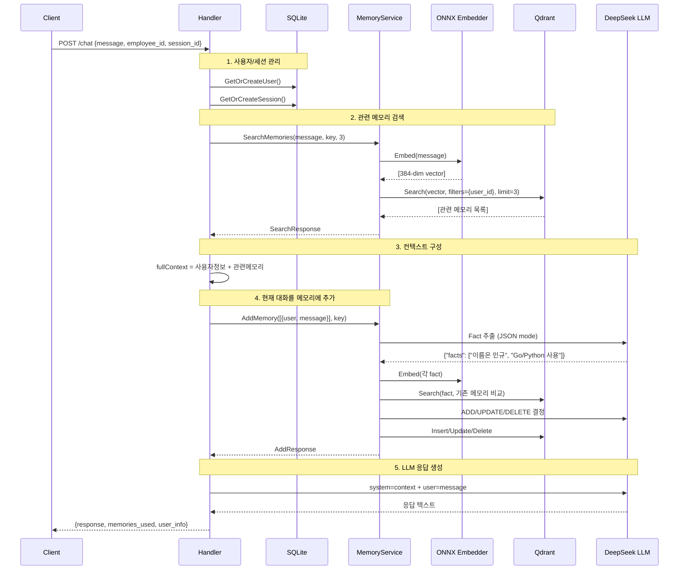
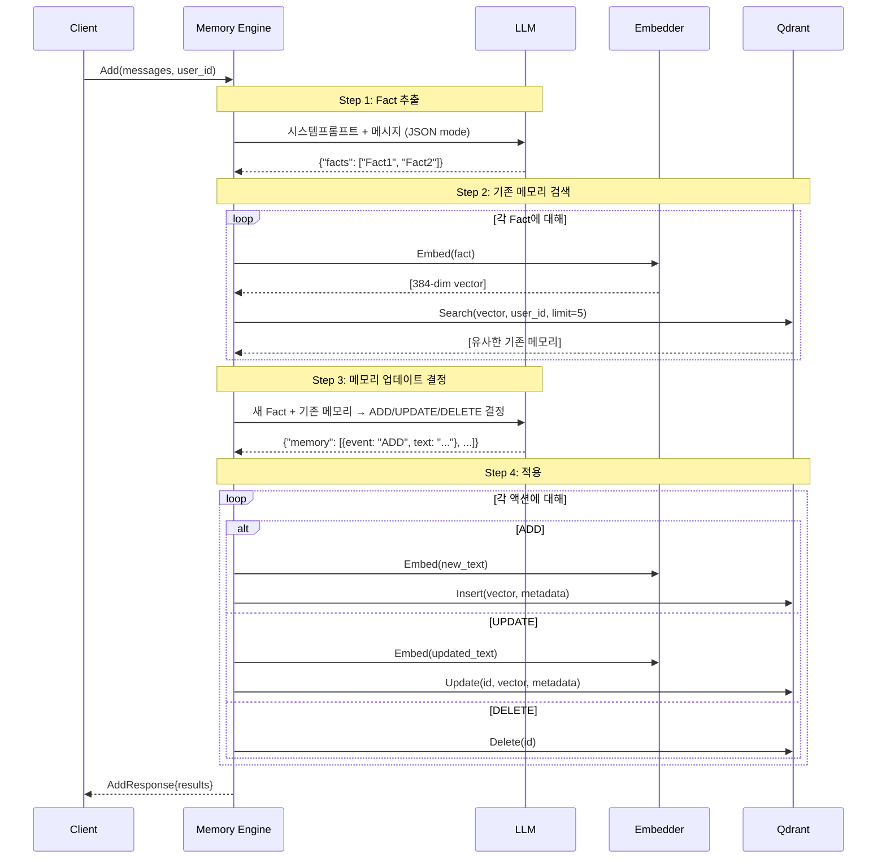
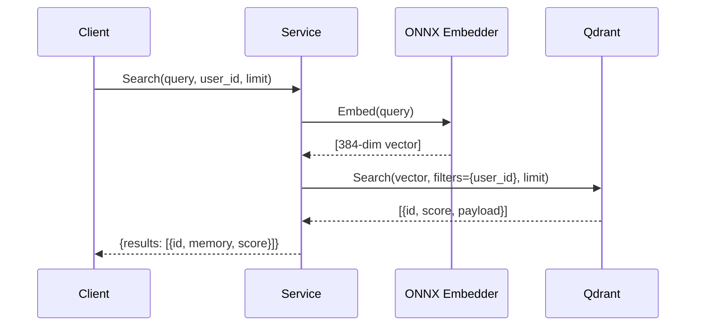
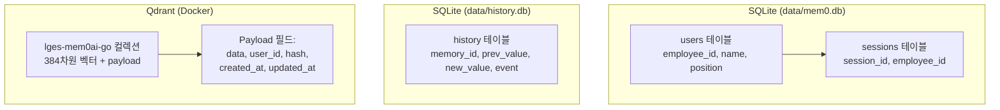

# 작동 로직 (Data Flow)

> 핵심 기능별 데이터 흐름과 내부 동작 메커니즘

## 1. 채팅 흐름 (`POST /chat`)

가장 복잡한 엔드포인트로, 메모리 검색 → LLM 응답 생성 → 메모리 저장을 한 번에 수행합니다.



### 단계별 상세

| 단계 | 작업 | 컴포넌트 |
|------|------|----------|
| ① 사용자/세션 | employee_id로 사용자 조회 또는 생성, 세션 생성/갱신 | SQLite |
| ② 메모리 검색 | 현재 메시지를 임베딩 → Qdrant에서 유사 메모리 top-3 검색 | ONNX + Qdrant |
| ③ 컨텍스트 구성 | 사용자 정보(이름, 직급) + 검색된 메모리를 시스템 프롬프트에 추가 | Handler |
| ④ 메모리 저장 | LLM으로 Fact 추출 → 기존 메모리와 비교 → ADD/UPDATE/DELETE 수행 | LLM + Qdrant |
| ⑤ 응답 생성 | 컨텍스트가 포함된 시스템 프롬프트 + 사용자 메시지로 LLM 호출 | LLM |

---

## 2. 메모리 추가 흐름 (`POST /memory`)



### LLM 프롬프트 패턴

1. **Fact 추출** (`Personal Information Organizer`): 대화에서 핵심 사실을 JSON으로 추출
2. **메모리 업데이트 결정**: 새 Fact와 기존 메모리를 비교해 `ADD`/`UPDATE`/`DELETE`/`NONE` 결정

---

## 3. 메모리 검색 흐름 (`POST /memory/search`)



---

## 4. 임베딩 처리 흐름

```mermaid
graph LR
    subgraph Input
        Text["입력 텍스트"]
    end

    subgraph HFTokenizer["HF Tokenizer (Unigram)"]
        PreTok["Pre-tokenize<br/>공백 → ▁"]
        Viterbi["Viterbi<br/>최적 분할"]
        Special["Special Tokens<br/>&lt;s&gt; ... &lt;/s&gt;"]
    end

    subgraph ONNX["ONNX Runtime"]
        Model["multilingual-e5-small<br/>12 layers, 384-dim"]
    end

    subgraph PostProcess["후처리"]
        MeanPool["Mean Pooling<br/>attention_mask 기반"]
        L2Norm["L2 Normalization"]
    end

    Text --> PreTok --> Viterbi --> Special
    Special -->|input_ids<br/>attention_mask| Model
    Model -->|last_hidden_state<br/>[1, seq, 384]| MeanPool
    MeanPool --> L2Norm
    L2Norm -->|384-dim vector| Output["임베딩 벡터"]
```

### 토크나이저 상세

| 항목 | 값 |
|------|-----|
| 모델 | `intfloat/multilingual-e5-small` |
| 타입 | Unigram (SentencePiece) |
| Vocab 크기 | 250,002 |
| Special Tokens | `<s>`(0), `<pad>`(1), `</s>`(2), `<unk>`(3) |
| 최대 길이 | 512 tokens |
| 출력 차원 | 384 |

---

## 5. 메모리 키 격리

세션별 메모리 격리를 위해 `employee_id` + `session_id` 조합을 사용합니다:

```
memoryKey = "{employee_id}_{session_id}"  // e.g., "test001_sess001"
```

이 키는 Qdrant의 `user_id` 필터로 사용되어, 같은 사용자라도 세션별로 독립적인 메모리 공간을 가집니다.

---

## 6. 데이터 저장소 구성



| 저장소 | 용도 | 데이터 |
|--------|------|--------|
| `data/mem0.db` | 사용자/세션 메타데이터 | employee_id, name, position, session info |
| `data/history.db` | 메모리 변경 이력 | ADD/UPDATE/DELETE 이벤트 |
| Qdrant | 벡터 + 메모리 텍스트 | 384-dim 임베딩 + metadata payload |
