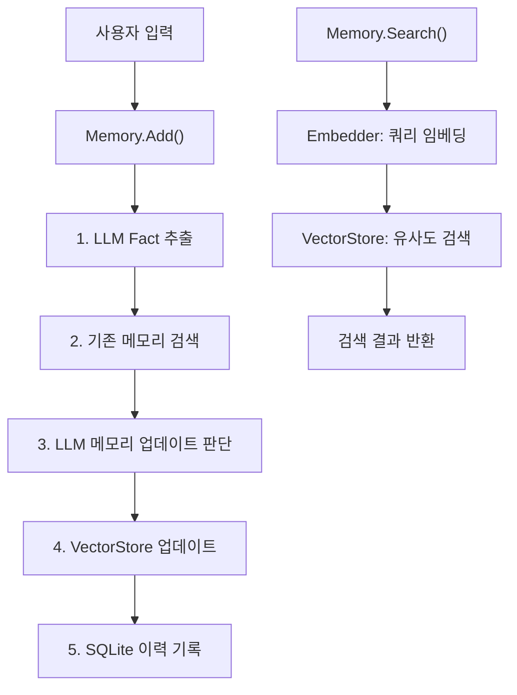
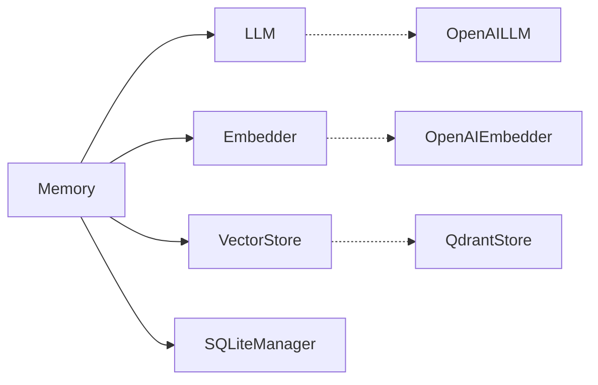

# 아키텍처 문서

## 시스템 구조



## 컴포넌트 구성



- **실선**: 의존성 (인터페이스)
- **점선**: 구현체

## Memory.Add() 플로우

`Memory.Add()`는 mem0의 핵심 로직입니다. 총 5단계로 동작합니다:

### Step 1: Fact 추출

사용자와 어시스턴트의 대화를 LLM에 전달하여 핵심 정보를 추출합니다.

**입력:**
```
user: 안녕하세요, 제 이름은 민수이고 소프트웨어 엔지니어입니다.
assistant: 반갑습니다 민수님!
```

**LLM 응답:**
```json
{"facts": ["이름은 민수", "소프트웨어 엔지니어"]}
```

### Step 2: 기존 메모리 검색

추출된 각 fact를 임베딩하여 벡터 스토어에서 관련 기존 메모리를 검색합니다.

```
"이름은 민수" → embedding → Qdrant Search → [기존 메모리 목록]
```

### Step 3: 메모리 업데이트 판단

기존 메모리와 새 fact를 LLM에 전달하여 각각에 대해 ADD/UPDATE/DELETE/NONE을 결정합니다.

**LLM 응답:**
```json
{
  "memory": [
    {"id": "0", "text": "이름은 민수", "event": "ADD"},
    {"id": "1", "text": "소프트웨어 엔지니어", "event": "ADD"}
  ]
}
```

### Step 4: VectorStore 업데이트

LLM의 결정에 따라 벡터 스토어를 업데이트합니다:

| 이벤트 | 동작 |
|--------|------|
| ADD | 새 UUID 생성 → 임베딩 + 메타데이터 저장 |
| UPDATE | 기존 ID 유지 → 임베딩 + 메타데이터 갱신 |
| DELETE | 벡터 스토어에서 해당 ID 삭제 |
| NONE | 아무 작업 없음 |

### Step 5: 이력 기록

모든 변경사항을 SQLite `history` 테이블에 기록합니다:

| 필드 | 설명 |
|------|------|
| memory_id | 메모리 UUID |
| prev_value | 이전 값 (UPDATE/DELETE 시) |
| new_value | 새 값 (ADD/UPDATE 시) |
| event | ADD, UPDATE, DELETE |
| created_at | 생성 시각 |
| updated_at | 수정 시각 |

## Memory.Search() 플로우

```
쿼리 → Embedder.Embed() → VectorStore.Search(vector, filters) → 결과 정렬 → 반환
```

- `user_id` 필터를 적용하여 사용자 격리
- Qdrant의 코사인 유사도로 상위 N개 결과 반환

## 데이터 저장 구조

### Qdrant (벡터 스토어)

각 메모리는 Qdrant의 Point로 저장됩니다:

| 필드 | 타입 | 설명 |
|------|------|------|
| ID | UUID | 메모리 고유 ID |
| Vector | float32[] | 1536차원 임베딩 벡터 |
| Payload.data | string | 메모리 텍스트 |
| Payload.hash | string | MD5 해시 |
| Payload.user_id | string | 사용자 ID |
| Payload.created_at | string | 생성 시각 (RFC3339) |
| Payload.updated_at | string | 수정 시각 (RFC3339) |

### SQLite (이력)

`history` 테이블 스키마:

```sql
CREATE TABLE history (
    id TEXT PRIMARY KEY,
    memory_id TEXT NOT NULL,
    prev_value TEXT,
    new_value TEXT,
    event TEXT NOT NULL,
    created_at TEXT,
    updated_at TEXT,
    is_deleted INTEGER DEFAULT 0
);
```

## Python 원본과의 차이점

| 항목 | Python | Go |
|------|--------|----|
| 벡터 스토어 기본값 | Qdrant (REST) | Qdrant (gRPC) |
| Graph Store | 지원 | 미지원 (범위 외) |
| Reranker | 지원 | 미지원 (범위 외) |
| Async | AsyncMemory 별도 클래스 | 미구현 (범위 외) |
| 비전 메시지 | 지원 | 미지원 (범위 외) |
| 절차적 메모리 | 지원 | 미지원 (범위 외) |
| 텔레메트리 | 지원 | 미구현 |
| 테스트 | pytest | go test + Mock 인터페이스 |
